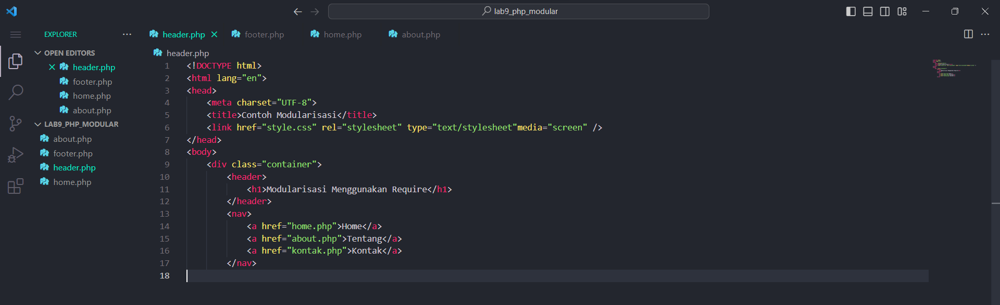

# Tugas Praktikum { Pertemuan ke 11 } 


|**Nama**|**NIM**|**Kelas**|**Matkul**|
|----|---|-----|------|
|Muhammad Ikhsan Fakhrudin|312210019|TI.22.A.2|Pemrograman Web 1|

# Web Framework

## Langkah-Langkah Praktikum

Membuka ``text editor`` , di sini saya menggunakan ***Visual Studio Code.***


### Buat file baru dengan nama 'header.php'



### Buat file baru dengan nama 'footer.php'


### Buat file baru dengan nama 'home.php'


### Buat file baru dengan nama 'about.php'


### ***Output :***

- Halaman ``home.php`` 


- Halaman ``about.php``


## Pertanyaan dan Tugas

- Implementasikan ``konsep modularisasi`` pada kode program praktikum 8 tentang database, sehingga setiap halamannya memiliki template tampilan yang sama.

## Berikut Struktur Yg Saya Buat :

```
lab9_php_database

Config :

- koneksi.php
- tambah.php
- ubah.php
- hapus.php

Layouts :

- head-static.php
- header.php
- main.php
- footer.php
```


## SELESAI  